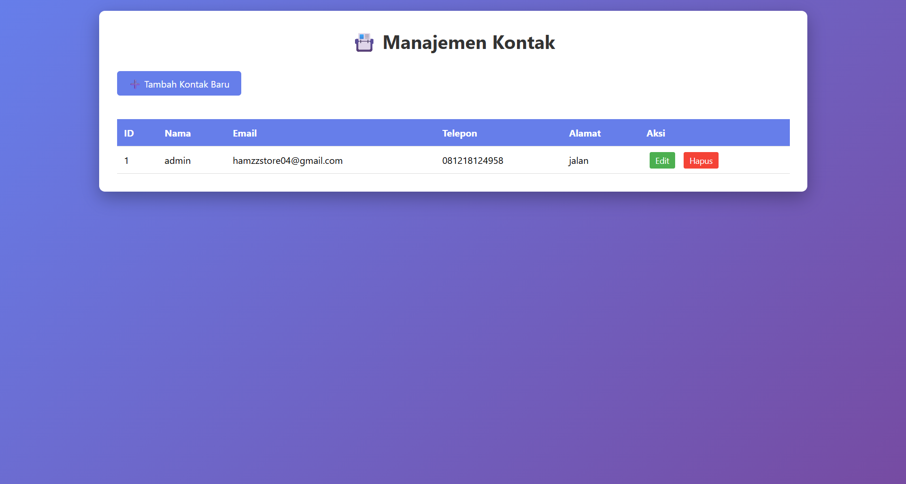

# CRUD Application - Contact Management

Simple CRUD (Create, Read, Update, Delete) application built with PHP and MySQL.

## Features

- ✅ Add new contact
- ✅ View all contacts
- ✅ Edit contact
- ✅ Delete contact
- ✅ Responsive design
- ✅ Form validation

## Technologies Used

- PHP 8.1
- MySQL 8.0
- HTML5
- CSS3
- JavaScript

## Installation

1. Clone this repository
```bash
git clone git@github.com:ilhamdevelops/crud-php-mysql.git
```

2. Create database
```sql
CREATE DATABASE crud_app;
USE crud_app;

CREATE TABLE contacts (
    id INT AUTO_INCREMENT PRIMARY KEY,
    name VARCHAR(100) NOT NULL,
    email VARCHAR(100) NOT NULL,
    phone VARCHAR(20),
    address TEXT,
    created_at TIMESTAMP DEFAULT CURRENT_TIMESTAMP
);
```

3. Configure database connection
- Copy `config.sample.php` to `config.php`
- Edit database credentials in `config.php`

4. Open in browser
```
http://localhost/crud-app/
```

## Database Configuration

Create a `config.php` file with your database credentials:
```php
<?php
define('DB_HOST', 'localhost');
define('DB_USER', 'your_username');
define('DB_PASS', 'your_password');
define('DB_NAME', 'crud_app');

$conn = mysqli_connect(DB_HOST, DB_USER, DB_PASS, DB_NAME);

if (!$conn) {
    die("Connection failed: " . mysqli_connect_error());
}
?>
```

## Screenshots



## License

MIT License

## Author

Your Name - [GitHub](https://github.com/ilhamdevelops)
